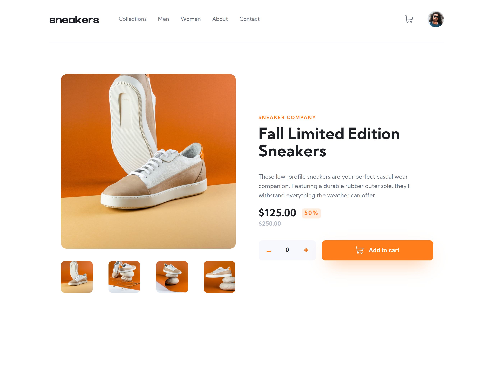

# Frontend Mentor - E-commerce product page solution

This is my solution to the [E-commerce product page challenge on Frontend Mentor](https://www.frontendmentor.io/challenges/ecommerce-product-page-UPsZ9MJp6).

## Table of contents

-   [Overview](#overview)
    -   [The challenge](#the-challenge)
    -   [Screenshot](#screenshot)
    -   [Links](#links)
-   [My process](#my-process)
    -   [Built with](#built-with)
    -   [What I learned](#what-i-learned)
    -   [Useful resources](#useful-resources)
-   [Author](#author)

## Overview

### The challenge

Users should be able to:

-   View the optimal layout for the site depending on their device's screen size
-   See hover states for all interactive elements on the page
-   Open a lightbox gallery by clicking on the large product image
-   Switch the large product image by clicking on the small thumbnail images
-   Add items to the cart
-   View the cart and remove items from it

### Screenshot

### Links

-   Solution URL: [Solution URL ](https://github.com/Andro87/ecommerce-product-page.git)
-   Live Site URL: [Live site URL here](https://ecommerce-product-page-gilt.vercel.app/)

## My process

### Built with

-   Semantic HTML5 markup
-   SCSS
-   Flexbox
-   CSS Grid
-   Mobile-first workflow
-   [React](https://reactjs.org/) - JS library
-   [Next.js](https://nextjs.org/) - React framework

### What I learned

This project tested my knowledge of React and allowed me to learn about React Context and useContext() and practice it.
The most challenging aspects I worked on were :

-   how to structure the code to better use Context when necessary;
-   learn how to use the context as a component,
-   use Embla Carousel library to switch through images smoothly;

### Useful resources

-   [Embla](https://www.embla-carousel.com/) - A library that helped my to find a way to smoothly switch the image by clicking on the thumbnails images.

-   [React Context for beginners](https://www.freecodecamp.org/news/react-context-for-beginners/) - A useful resource to start learning about React Context.

-   [React Context and usecontext](https://dmitripavlutin.com/react-context-and-usecontext/#32-when-context-changes) - Another great resource that helped me to have a better understanding of React Context.

## Author

-   Frontend Mentor - [@Andro87](https://www.frontendmentor.io/profile/Andro87)
